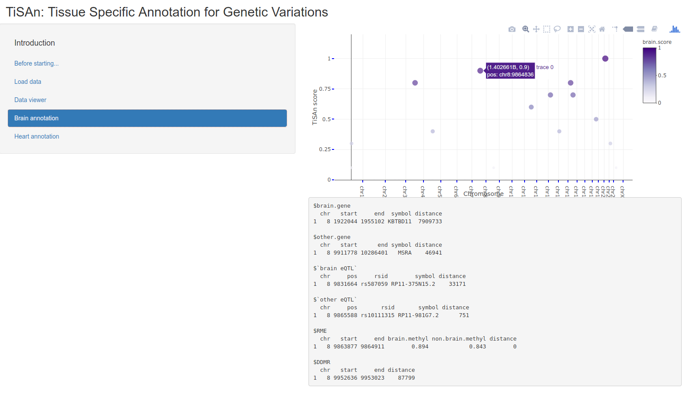
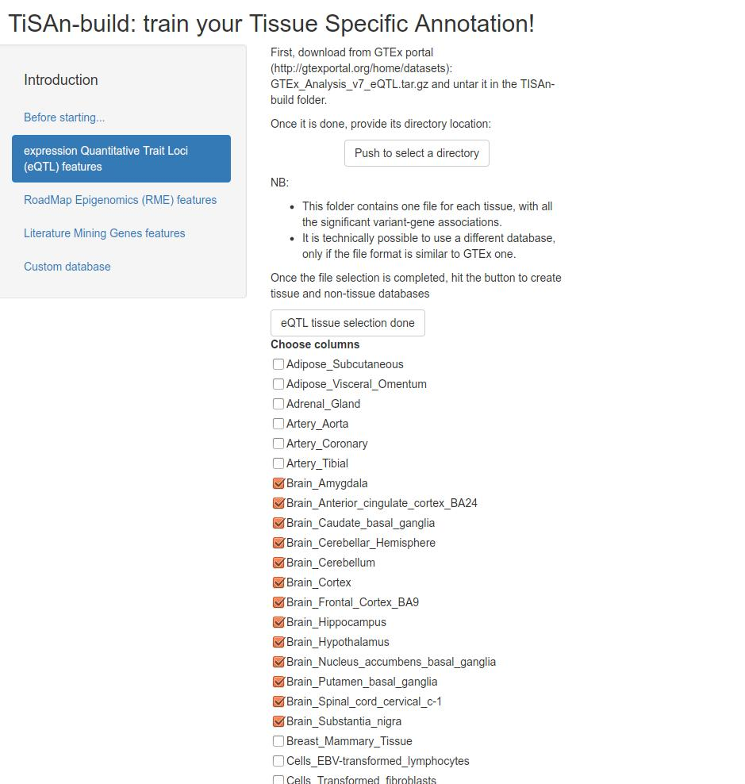

# TiSAn
Tissue-specific variant annotation

Preprint version: http://www.biorxiv.org/content/early/2017/08/30/141408

This project aims at providing a functional annotation tool for genetic variation, using prior on different tissues.
The general framework proposed with TiSAn will help researchers creating a predictive model for their tissue of interest.
Here, two models are made available as examples: the human brain and heart.

## Installation 
Run the following command in R:

`devtools::install_github("kevinVervier/TiSAn")`

## Dependencies (R packages)
All packages should be installed automatically at the same time that TiSAn package.

## Databases
User can find human brain and heart databases, as gzipped .bed files (+index) at: http://flamingo.psychiatry.uiowa.edu/TiSAn/
- TiSAn_Heart.bed.gz
- TiSAn_Heart.bed.gz.tbi
- TiSAn_Brain.bed.gz
- TiSAn_Brain.bed.gz.tbi

For the following examples, we assume that those databases have been downloaded and stored in the `data` repository.

## Variants set annotation

To automatically annotate variants with TiSAn scores, we propose to use `vcfanno` tool (http://github.com/brentp/vcfanno). Please note that most of the annotation tools will work with a database in bed format.
The following command calls `vcfanno` on a VCF file containing positions to be annotated, and a configuration containing  parameters for `vcfanno`.

`vcfanno data/TiSAn.conf data/example1.vcf` 

The output is a new VCF file with an additional FORMAT column with two fields (TiSB for brain and TiSH for heart):

`#CHROM	POS	ID	REF	ALT	QUAL	FILTER	INFO	FORMAT`

`1	1005806	rs3934834	C	T	0.0	PASS	TiSB=0;TiSH=0.4307`

`1	243943084	rs4132509	C	A	0.0	PASS	TiSB=0;TiSH=0.5663`

`13	81753314	rs12584499	C	G	0.0	PASS	TiSB=0.718;TiSH=0`

`14	62763347	rs2354331	C	T	0.0	PASS	TiSB=0.358;TiSH=0.2904`

`21	37417489	rs2835248	A	G	0.0	PASS	TiSB=0;TiSH=0`

`4	154746806	rs10031057	A	G	0.0	PASS	TiSB=0;TiSH=0.8565`

## UCSC track visualization

For region-based analysis, we provide genome-wide annotations on the UCSC Genome Browser website. 
- Step 1: Access the custom track page: 

http://genome.ucsc.edu/cgi-bin/hgCustom?hgsid=447125520_fox8vKausTjV0qFdw8xfg3BoQZwL&clade=&org=Human&db=hg19&hgct_do_add=1

- Step 2: Paste the following text into the "Paste URLs or data" box, and click "submit":

track type=bigWig name="Brain" description="TiSAn-Brain" visibility=full autoScale=off alwaysZero=on maxHeightPixels=100:30:10 color=24,181,84 bigDataUrl=http://flamingo.psychiatry.uiowa.edu/TiSAn/TiSAn_Brain.bw
track type=bigWig name="Heart" description="TiSAn-Heart" visibility=full autoScale=off alwaysZero=on maxHeightPixels=100:30:10 color=181,24,84 bigDataUrl=http://flamingo.psychiatry.uiowa.edu/TiSAn/TiSAn_Heart.bw

This will result in adding 2 tracks (TiSAn-Brain and TiSAn-Heart scores).

## TiSAn-view

We also developed a GUI to efficiently annotate shortlists of genomic loci, and get details on individual feature used by TiSAn to make the predictions.
Please refer to the TISAn-view folder on this Github repository.

## TiSAn-build

We developed a GUI to efficiently create tissue-specific databases from publically available datasets. Different panels cover GTEx eQTLs, RoadMap Epigenomics DNA methylation, literature mining on PubMed, and a custom database that could be changed by users.
Please refer to the TISAn-build folder on this Github repository.

